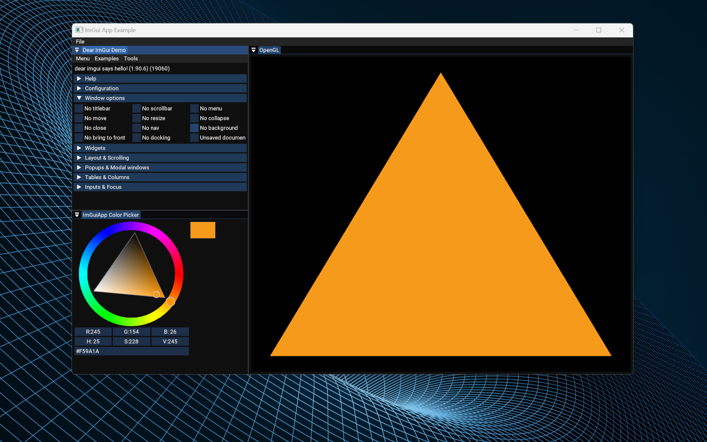
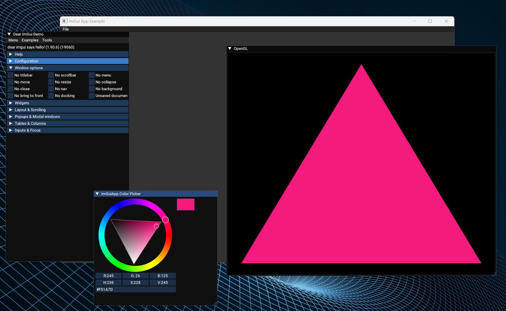
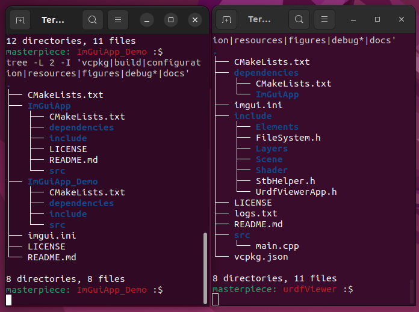

# ImGuiApp Demo Project

This project show cases a sample application using [ImGuiApp](https://github.com/MasterpieceNKA/ImGuiApp).

[ImGuiApp](https://github.com/MasterpieceNKA/ImGuiApp) provides some basic functionality needed to quickly create C++ gui applications using the GLFW and OpenGL backends of [Dear ImGui](https://github.com/ocornut/imgui). [ImGuiApp](https://github.com/MasterpieceNKA/ImGuiApp) uses CMake and has been tested on Windows 11 (MinGW & Clang 18.1.5) and Linux (Ubuntu 22.04 with GNU 11.4.0 compiler).

This project is inspired by [Walnut](https://github.com/StudioCherno/Walnut) which is built using uses Vulkan instead of OpenGL.



ImGuiApp Demo Application




ImGuiApp Demo Application with undocked windows


## Requirements
- [CMake](https://cmake.org/)
- [Clang](https://clang.llvm.org/) or [MinGW](https://www.mingw-w64.org/) (Windows) or Your favorite Linux C++ compile (Linux)
- IDE of choice [Visual Studio Code](https://code.visualstudio.com/) (tested) or [Visual Studio 2022](https://visualstudio.com) (not fully tested)

## Getting Started
1. Clone the repository
    ```ps
    git clone --recursive https://github.com/MasterpieceNKA/ImGuiApp_Demo.git

    cd ImGuiApp_Demo
    ``` 

2. Build and run the project depending on Operating System

    For Windows or Linux build and run the project using (with clang compiler) 

    ```ps
    mkdir build 
    
    cd build

    cmake ..

    cmake --build .

    .\bin\Debug\ImGuiApp_Demo
    ``` 

    For Windows or Linux build and run the project using (with default compiler)

    ```

    mkdir build 
    
    cd build

    cmake .. -DCMAKE_CXX_COMPILER=clang++ -DCMAKE_C_COMPILER=clang

    cmake --build .

    .\bin\Debug\ImGuiApp_Demo

    ```
    
    Or using provided build scripts for Windows that either Clang ```.\debugBuild_clang.bat```   or MinGW ```.\debugBuild_MinGW.bat```         


        
    
3. Customise and use other project structures according to your needs
 


Example project structure setups for using ImGuiApp 


## 3rd party libaries
- [Dear ImGui](https://github.com/ocornut/imgui)
- [GLFW](https://github.com/glfw/glfw)
- [GLEW](https://github.com/nigels-com/glew)
- [GLM](https://github.com/g-truc/glm)
- [spdlog](https://github.com/gabime/spdlog)


## Additional
- ImGuiApp uses the [Roboto](https://fonts.google.com/specimen/Roboto) font ([Apache License, Version 2.0](https://www.apache.org/licenses/LICENSE-2.0))
- Documentation generated using [Doxygen](https://www.doxygen.nl/)

